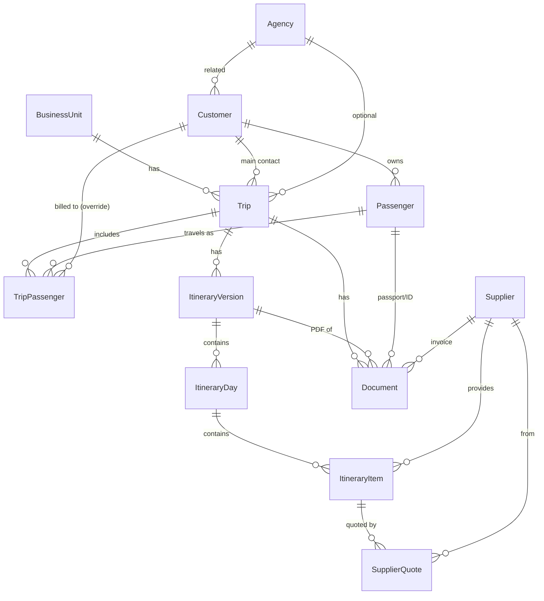

# Data Model (Dataverse)

12 tables with a `at_` publisher prefix and reusable **global Choices** (option sets). Master tables feed transactional tables; everything routes back to a central `Trip`.

## Entity-relationship diagram

## Tables

| Table | Primary column | Purpose |
|---|---|---|
| **Business Units** | Business Unit Name | Operating units / brands |
| **Agencies** | Agency Name | Partner agencies (commission, contact) |
| **Customers** | Full Name | The buyer / account being billed |
| **Passengers** | Full Name | Travellers (passport, nationality, DOB) |
| **Suppliers** | Supplier Name | Hotels, airlines, ground operators… |
| **Trips** | Trip Name | Central record; Business Unit, Main Contact, destination, dates, status, estimates |
| **Trip Passengers** | Trip Passenger Name | Junction: which passengers are on a trip, role, rooming, billed-to override |
| **Itinerary Versions** | Version Name | Preliminary / Official / Final versions of a trip's itinerary |
| **Itinerary Days** | Day Title | Days within a version (number, date, summary) |
| **Itinerary Items** | Item Title | Typed activities within a day (cost/sale/margin, supplier, hotel fields) |
| **Supplier Quotes** | Quote Name | Quotes tied to a specific itinerary item & supplier |
| **Documents** | File Name | Vouchers & PDFs linked to trip / version / passenger / supplier |

## Global Choices (option sets)

`Business Unit Type`, `Record Status`, `Customer Type`, `Trip Status` (11 states from "inquiry received" → "completed"), `Passenger Role`, `Itinerary Version Type`, `Itinerary Version Status`, `Currency`, `Item Type`, `Itinerary Item Status`, `Supplier Type`, `Quote Status`, `Document Type`.

## Design decisions

- **Versioning over editing** — trips keep multiple itinerary versions so an "official" itinerary is preserved while new variants are cloned and edited.
- **Quotes at the item level** — a `Supplier Quote` points to the exact `Itinerary Item`, enabling per-service price comparison and a "winning quote" that writes back to the item.
- **Billing flexibility** — a trip has a single Main Contact (Customer) by default, with an optional per-passenger Customer override for split invoicing.
- **Files as links** — Documents store a SharePoint URL (`File Link`); a Power Automate flow uploads the actual file and fills the link.
